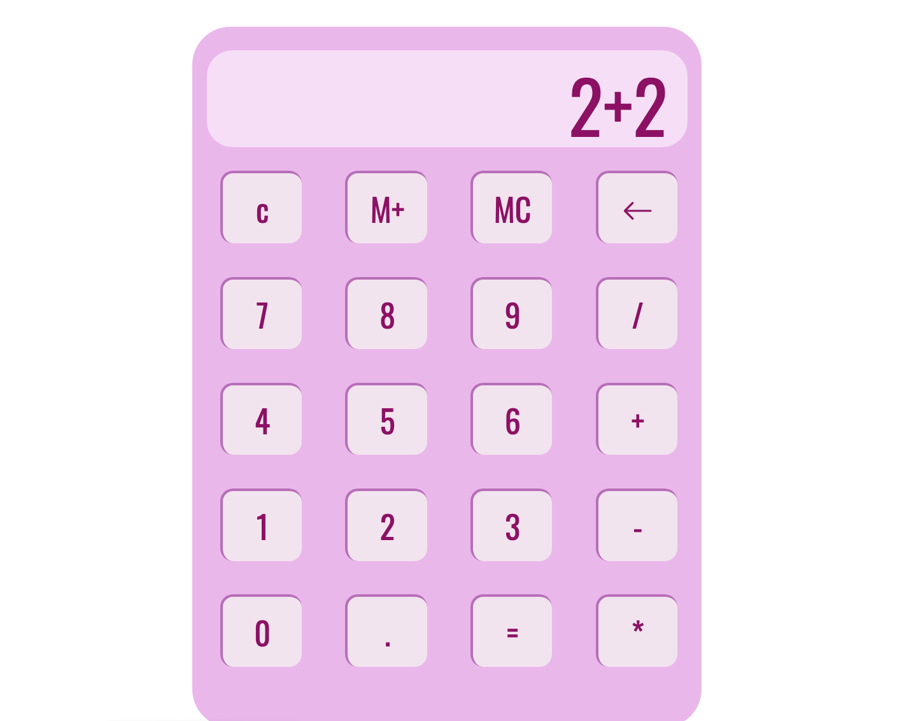

<h1 align="center">🧮 Mi primer Calculadora</h1>

  

<h2>📌 Descripción</h2>

Esta es una <strong>calculadora web</strong> desarrollada con <strong>HTML, CSS y JavaScript puro</strong>, que permite realizar operaciones matemáticas básicas con un diseño responsivo y botones interactivos.  
El proyecto fue creado para practicar la manipulación del <strong>DOM</strong>, el manejo de <strong>eventos</strong> y la lógica en <strong>JavaScript</strong>.

<h2>⚙️ Instalación y uso</h2>

1. Clona el repositorio:

<code>git clone https://github.com/karina-ruiz/calculadora-js.git</code>

2. Entra a la carpeta del proyecto:

<code>cd calculadora-js</code>

3. Abre el archivo <code>index.html</code> en tu navegador. 
(No requiere servidor ni instalación adicional)

